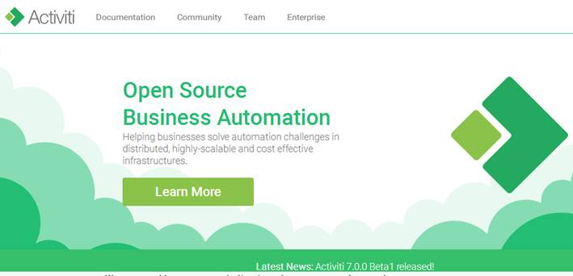
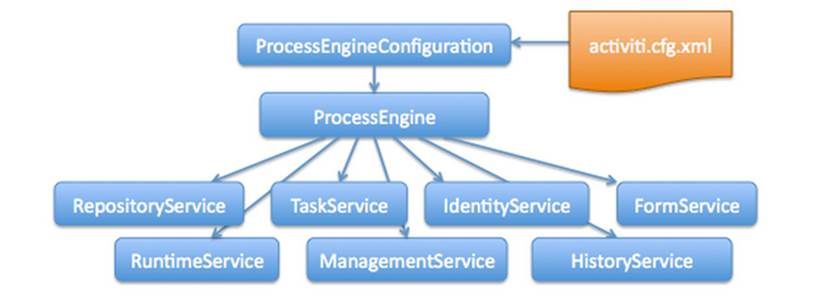
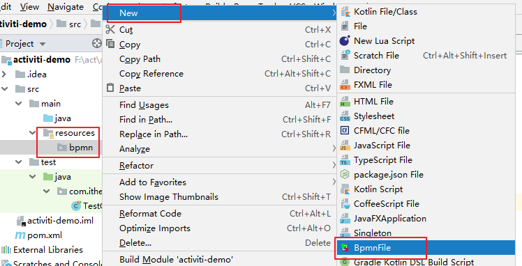
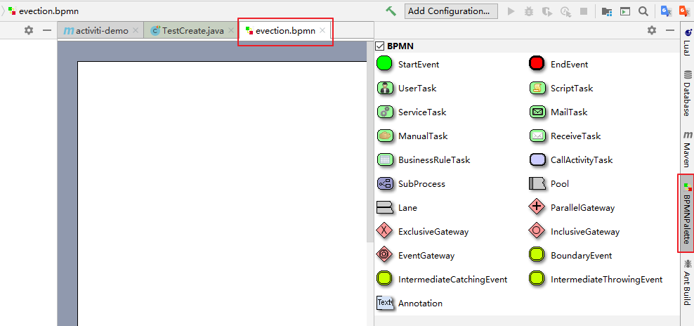
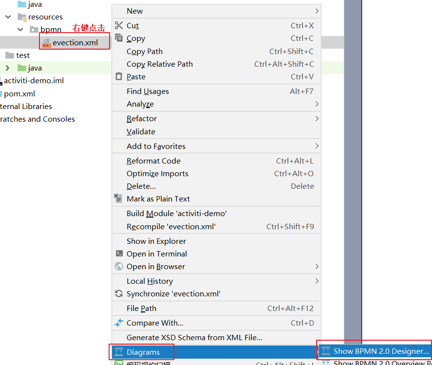

# 集成Activiti7(基础)

> B站教学视频:https://www.bilibili.com/video/BV1H54y167gf?p=1&vd_source=4f29ed23e5c29723fd1ba4fc53288e87

# 一、工作流介绍

## 1.1 概念

工作流(Workflow)，就是通过计算机对业务流程自动化执行管理。它主要解决的是“使在多个参与者之间按照某种预定义的规则自动进行传递文档、信息或任务的过程，从而实现某个预期的业务目标，或者促使此目标的实现”。

## 1.2 工作流系统

一个软件系统中具有工作流的功能，我们把它称为工作流系统，一个系统中工作流的功能是什么？就是对系统的业务流程进行自动化管理，所以工作流是建立在业务流程的基础上，所以一个软件的系统核心根本上还是系统的业务流程，工作流只是协助进行业务流程管理。即使没有工作流业务系统也可以开发运行，只不过有了工作流可以更好的管理业务流程，提高系统的可扩展性。

## 1.3 适用行业

消费品行业，制造业，电信服务业，银证险等金融服务业，物流服务业，物业服务业，物业管理，大中型进出口贸易公司，政府事业机构，研究院所及教育服务业等，特别是大的跨国企业和集团公司。

## 1.4 具体应用

1、关键业务流程：订单、报价处理、合同审核、客户电话处理、供应链管理等

2、行政管理类:出差申请、加班申请、请假申请、用车申请、各种办公用品申请、购买申请、日报周报等凡是原来手工流转处理的行政表单。

3、人事管理类：员工培训安排、绩效考评、职位变动处理、员工档案信息管理等。

4、财务相关类：付款请求、应收款处理、日常报销处理、出差报销、预算和计划申请等。

5、客户服务类：客户信息管理、客户投诉、请求处理、售后服务管理等。

6、特殊服务类：ISO系列对应流程、质量管理对应流程、产品数据信息管理、贸易公司报关处理、物流公司货物跟踪处理等各种通过表单逐步手工流转完成的任务均可应用工作流软件自动规范地实施。

## 1.5 实现方式

在没有专门的工作流引擎之前，我们之前为了实现流程控制，通常的做法就是采用状态字段的值来跟踪流程的变化情况。这样不用角色的用户，通过状态字段的取值来决定记录是否显示。

 针对有权限可以查看的记录，当前用户根据自己的角色来决定审批是否合格的操作。如果合格将状态字段设置一个值，来代表合格；当然如果不合格也需要设置一个值来代表不合格的情况。

 这是一种最为原始的方式。通过状态字段虽然做到了流程控制，但是当我们的流程发生变更的时候，这种方式所编写的代码也要进行调整。

 那么有没有专业的方式来实现工作流的管理呢？并且可以做到业务流程变化之后，我们的程序可以不用改变，如果可以实现这样的效果，那么我们的业务系统的适应能力就得到了极大提升。

# 二、Activiti7概述

## 2.1 介绍

Alfresco软件在2010年5月17日宣布Activiti业务流程管理（BPM）开源项目的正式启动，其首席架构师由业务流程管理BPM的专家 Tom Baeyens担任，Tom Baeyens就是原来jbpm的架构师，而jbpm是一个非常有名的工作流引擎，当然activiti也是一个工作流引擎。

Activiti是一个工作流引擎， activiti可以将业务系统中复杂的业务流程抽取出来，使用专门的建模语言BPMN2.0进行定义，业务流程按照预先定义的流程进行执行，实现了系统的流程由activiti进行管理，减少业务系统由于流程变更进行系统升级改造的工作量，从而提高系统的健壮性，同时也减少了系统开发维护成本。

官方网站：<https://www.activiti.org/>



经历的版本:


目前最新版本：Activiti7.0.0.Beta

### 2.1.1 BPM

BPM（Business Process Management），即业务流程管理，是一种规范化的构造端到端的业务流程，以持续的提高组织业务效率。常见商业管理教育如EMBA、MBA等均将BPM包含在内。

### 2.1.2 BPM软件

BPM软件就是根据企业中业务环境的变化，推进人与人之间、人与系统之间以及系统与系统之间的整合及调整的经营方法与解决方案的IT工具。

通过BPM软件对企业内部及外部的业务流程的整个生命周期进行建模、自动化、管理监控和优化，使企业成本降低，利润得以大幅提升。

BPM软件在企业中应用领域广泛，凡是有业务流程的地方都可以BPM软件进行管理，比如企业人事办公管理、采购流程管理、公文审批流程管理、财务管理等。

### 2.1.3 BPMN

BPMN（Business Process Model AndNotation）- 业务流程模型和符号 是由BPMI（BusinessProcess Management Initiative）开发的一套标准的业务流程建模符号，使用BPMN提供的符号可以创建业务流程。 

2004年5月发布了BPMN1.0规范.BPMI于2005年9月并入OMG（The Object Management Group对象管理组织)组织。OMG于2011年1月发布BPMN2.0的最终版本。

具体发展历史如下: 


BPMN 是目前被各 BPM 厂商广泛接受的 BPM 标准。Activiti 就是使用 BPMN 2.0 进行流程建模、流程执行管理，它包括很多的建模符号，比如：

Event 

用一个圆圈表示，它是流程中运行过程中发生的事情。


活动用圆角矩形表示，一个流程由一个活动或多个活动组成


Bpmn图形其实是通过xml表示业务流程，上边的.bpmn文件使用文本编辑器打开：

```xml
<?xml version="1.0" encoding="UTF-8"?>
<definitions xmlns="http://www.omg.org/spec/BPMN/20100524/MODEL" xmlns:xsi="http://www.w3.org/2001/XMLSchema-instance" xmlns:xsd="http://www.w3.org/2001/XMLSchema" xmlns:activiti="http://activiti.org/bpmn" xmlns:bpmndi="http://www.omg.org/spec/BPMN/20100524/DI" xmlns:omgdc="http://www.omg.org/spec/DD/20100524/DC" xmlns:omgdi="http://www.omg.org/spec/DD/20100524/DI" typeLanguage="http://www.w3.org/2001/XMLSchema" expressionLanguage="http://www.w3.org/1999/XPath" targetNamespace="http://www.activiti.org/test">
  <process id="myProcess" name="My process" isExecutable="true">
    <startEvent id="startevent1" name="Start"></startEvent>
    <userTask id="usertask1" name="创建请假单"></userTask>
    <sequenceFlow id="flow1" sourceRef="startevent1" targetRef="usertask1"></sequenceFlow>
    <userTask id="usertask2" name="部门经理审核"></userTask>
    <sequenceFlow id="flow2" sourceRef="usertask1" targetRef="usertask2"></sequenceFlow>
    <userTask id="usertask3" name="人事复核"></userTask>
    <sequenceFlow id="flow3" sourceRef="usertask2" targetRef="usertask3"></sequenceFlow>
    <endEvent id="endevent1" name="End"></endEvent>
    <sequenceFlow id="flow4" sourceRef="usertask3" targetRef="endevent1"></sequenceFlow>
  </process>
  <bpmndi:BPMNDiagram id="BPMNDiagram_myProcess">
    <bpmndi:BPMNPlane bpmnElement="myProcess" id="BPMNPlane_myProcess">
      <bpmndi:BPMNShape bpmnElement="startevent1" id="BPMNShape_startevent1">
        <omgdc:Bounds height="35.0" width="35.0" x="130.0" y="160.0"></omgdc:Bounds>
      </bpmndi:BPMNShape>
      <bpmndi:BPMNShape bpmnElement="usertask1" id="BPMNShape_usertask1">
        <omgdc:Bounds height="55.0" width="105.0" x="210.0" y="150.0"></omgdc:Bounds>
      </bpmndi:BPMNShape>
      <bpmndi:BPMNShape bpmnElement="usertask2" id="BPMNShape_usertask2">
        <omgdc:Bounds height="55.0" width="105.0" x="360.0" y="150.0"></omgdc:Bounds>
      </bpmndi:BPMNShape>
      <bpmndi:BPMNShape bpmnElement="usertask3" id="BPMNShape_usertask3">
        <omgdc:Bounds height="55.0" width="105.0" x="510.0" y="150.0"></omgdc:Bounds>
      </bpmndi:BPMNShape>
      <bpmndi:BPMNShape bpmnElement="endevent1" id="BPMNShape_endevent1">
        <omgdc:Bounds height="35.0" width="35.0" x="660.0" y="160.0"></omgdc:Bounds>
      </bpmndi:BPMNShape>
      <bpmndi:BPMNEdge bpmnElement="flow1" id="BPMNEdge_flow1">
        <omgdi:waypoint x="165.0" y="177.0"></omgdi:waypoint>
        <omgdi:waypoint x="210.0" y="177.0"></omgdi:waypoint>
      </bpmndi:BPMNEdge>
      <bpmndi:BPMNEdge bpmnElement="flow2" id="BPMNEdge_flow2">
        <omgdi:waypoint x="315.0" y="177.0"></omgdi:waypoint>
        <omgdi:waypoint x="360.0" y="177.0"></omgdi:waypoint>
      </bpmndi:BPMNEdge>
      <bpmndi:BPMNEdge bpmnElement="flow3" id="BPMNEdge_flow3">
        <omgdi:waypoint x="465.0" y="177.0"></omgdi:waypoint>
        <omgdi:waypoint x="510.0" y="177.0"></omgdi:waypoint>
      </bpmndi:BPMNEdge>
      <bpmndi:BPMNEdge bpmnElement="flow4" id="BPMNEdge_flow4">
        <omgdi:waypoint x="615.0" y="177.0"></omgdi:waypoint>
        <omgdi:waypoint x="660.0" y="177.0"></omgdi:waypoint>
      </bpmndi:BPMNEdge>
    </bpmndi:BPMNPlane>
  </bpmndi:BPMNDiagram>
</definitions>

```

## 2.2 使用步骤

### 部署activiti

Activiti是一个工作流引擎（其实就是一堆jar包API），业务系统访问(操作)activiti的接口，就可以方便的操作流程相关数据，这样就可以把工作流环境与业务系统的环境集成在一起。

### 流程定义

使用activiti流程建模工具(activity-designer)定义业务流程(.bpmn文件) 。

.bpmn文件就是业务流程定义文件，通过xml定义业务流程。

###   流程定义部署

activiti部署业务流程定义（.bpmn文件）。

使用activiti提供的api把流程定义内容存储起来，在Activiti执行过程中可以查询定义的内容

Activiti执行把流程定义内容存储在数据库中

### 启动一个流程实例

流程实例也叫：ProcessInstance

启动一个流程实例表示开始一次业务流程的运行。

在员工请假流程定义部署完成后，如果张三要请假就可以启动一个流程实例，如果李四要请假也启动一个流程实例，两个流程的执行互相不影响。

### 用户查询待办任务(Task)

因为现在系统的业务流程已经交给activiti管理，通过activiti就可以查询当前流程执行到哪了，当前用户需要办理什么任务了，这些activiti帮我们管理了，而不需要开发人员自己编写在sql语句查询。

### 用户办理任务

用户查询待办任务后，就可以办理某个任务，如果这个任务办理完成还需要其它用户办理，比如采购单创建后由部门经理审核，这个过程也是由activiti帮我们完成了。

### 流程结束

当任务办理完成没有下一个任务结点了，这个流程实例就完成了。

# 三、Activiti环境

## 3.1 开发环境

Jdk1.8或以上版本

Mysql 5及以上的版本

Tomcat8.5

IDEA

**注意：activiti的流程定义工具插件可以安装在IDEA下，也可以安装在Eclipse工具下**

## 3.2 Activiti环境

我们使用：Activiti7.0.0.Beta1  默认支持spring5

### 3.2.1 下载activiti7 

Activiti下载地址：<http://activiti.org/download.html> ，Maven的依赖如下：

 ```xml
<dependencyManagement>
    <dependencies>
        <dependency>
            <groupId>org.activiti</groupId>
            <artifactId>activiti-dependencies</artifactId>
            <version>7.0.0.Beta1</version>
            <scope>import</scope>
            <type>pom</type>
        </dependency>
    </dependencies>
</dependencyManagement>
 ```

**1)**      **Database**：

activiti运行需要有数据库的支持，支持的数据库有：h2, mysql, oracle, postgres, mssql, db2。

###  3.2.2 流程设计器IDEA下安装

在IDEA的File菜单中找到子菜单”Settings”,后面我们再选择左侧的“plugins”菜单，如下图所示：


此时我们就可以搜索到actiBPM插件，它就是Activiti Designer的IDEA版本，我们点击Install安装。

安装好后，页面如下：


提示需要重启idea，点击重启。

重启完成后，再次打开Settings 下的 Plugins（插件列表），点击右侧的Installed（已安装的插件），在列表中看到actiBPM，就说明已经安装成功了，如下图所示：


后面的课程里，我们会使用这个流程设计器进行Activiti的流程设计。

## 3.3 Activiti的数据库支持

Activiti 在运行时需要数据库的支持，使用25张表，把流程定义节点内容读取到数据库表中，以供后续使用。

### 3.3.1 Activiti 支持的数据库

activiti  支持的数据库和版本如下：

| 数据库类型 | 版本                   | JDBC连接示例                                            | 说明                               |
| ---------- | ---------------------- | ------------------------------------------------------- | ---------------------------------- |
| h2         | 1.3.168                | jdbc:h2:tcp://localhost/activiti                        | 默认配置的数据库                   |
| mysql      | 5.1.21                 | jdbc:mysql://localhost:3306/activiti?autoReconnect=true | 使用 mysql-connector-java 驱动测试 |
| oracle     | 11.2.0.1.0             | jdbc:oracle:thin:@localhost:1521:xe                     |                                    |
| postgres   | 8.1                    | jdbc:postgresql://localhost:5432/activiti               |                                    |
| db2        | DB2 10.1 using db2jcc4 | jdbc:db2://localhost:50000/activiti                     |                                    |
| mssql      | 2008 using sqljdbc4    | jdbc:sqlserver://localhost:1433/activiti                |                                    |

### 3.3.2 在MySQL生成表

#### 3.3.2.1 创建数据库

创建  mysql  数据库  activiti （名字任意）：

CREATE DATABASE activiti DEFAULT CHARACTER SET utf8;

#### 3.3.2.2 使用java代码生成表

##### 1） 创建 java 工程

使用idea 创建 java 的maven工程，取名：activiti01。

##### 2） 加入 maven 依赖的坐标（jar 包）

首先需要在 java 工程中加入 ProcessEngine 所需要的 jar 包，包括：

1) activiti-engine-7.0.0.beta1.jar
2) activiti 依赖的 jar 包： mybatis、 alf4j、 log4j 等

3) activiti 依赖的 spring 包

4) mysql数据库驱动

5) 第三方数据连接池 dbcp
6) 单元测试 Junit-4.12.jar

我们使用 maven 来实现项目的构建，所以应当导入这些 jar 所对应的坐标到 pom.xml 文件中。

完整的依赖内容如下：

```xml
<properties>
    <slf4j.version>1.6.6</slf4j.version>
    <log4j.version>1.2.12</log4j.version>
    <activiti.version>7.0.0.Beta1</activiti.version>
</properties>
<dependencies>
    <dependency>
        <groupId>org.activiti</groupId>
        <artifactId>activiti-engine</artifactId>
        <version>${activiti.version}</version>
    </dependency>
    <dependency>
        <groupId>org.activiti</groupId>
        <artifactId>activiti-spring</artifactId>
        <version>${activiti.version}</version>
    </dependency>
    <!-- bpmn 模型处理 -->
    <dependency>
        <groupId>org.activiti</groupId>
        <artifactId>activiti-bpmn-model</artifactId>
        <version>${activiti.version}</version>
    </dependency>
    <!-- bpmn 转换 -->
    <dependency>
        <groupId>org.activiti</groupId>
        <artifactId>activiti-bpmn-converter</artifactId>
        <version>${activiti.version}</version>
    </dependency>
    <!-- bpmn json数据转换 -->
    <dependency>
        <groupId>org.activiti</groupId>
        <artifactId>activiti-json-converter</artifactId>
        <version>${activiti.version}</version>
    </dependency>
    <!-- bpmn 布局 -->
    <dependency>
        <groupId>org.activiti</groupId>
        <artifactId>activiti-bpmn-layout</artifactId>
        <version>${activiti.version}</version>
    </dependency>
    <!-- activiti 云支持 -->
    <dependency>
        <groupId>org.activiti.cloud</groupId>
        <artifactId>activiti-cloud-services-api</artifactId>
        <version>${activiti.version}</version>
    </dependency>
    <!-- mysql驱动 -->
    <dependency>
        <groupId>mysql</groupId>
        <artifactId>mysql-connector-java</artifactId>
        <version>5.1.40</version>
    </dependency>
    <!-- mybatis -->
    <dependency>
        <groupId>org.mybatis</groupId>
        <artifactId>mybatis</artifactId>
        <version>3.4.5</version>
    </dependency>
    <!-- 链接池 -->
    <dependency>
        <groupId>commons-dbcp</groupId>
        <artifactId>commons-dbcp</artifactId>
        <version>1.4</version>
    </dependency>
    <dependency>
        <groupId>junit</groupId>
        <artifactId>junit</artifactId>
        <version>4.12</version>
    </dependency>
    <!-- log start -->
    <dependency>
        <groupId>log4j</groupId>
        <artifactId>log4j</artifactId>
        <version>${log4j.version}</version>
    </dependency>
    <dependency>
        <groupId>org.slf4j</groupId>
        <artifactId>slf4j-api</artifactId>
        <version>${slf4j.version}</version>
    </dependency>
    <dependency>
        <groupId>org.slf4j</groupId>
        <artifactId>slf4j-log4j12</artifactId>
        <version>${slf4j.version}</version>
    </dependency>
</dependencies>
```

##### 3） 添加log4j日志配置

我们使用log4j日志包，可以对日志进行配置

在resources 下创建log4j.properties

```properties
# Set root category priority to INFO and its only appender to CONSOLE.
#log4j.rootCategory=INFO, CONSOLE debug info warn error fatal
log4j.rootCategory=debug, CONSOLE, LOGFILE
# Set the enterprise logger category to FATAL and its only appender to CONSOLE.
log4j.logger.org.apache.axis.enterprise=FATAL, CONSOLE
# CONSOLE is set to be a ConsoleAppender using a PatternLayout.
log4j.appender.CONSOLE=org.apache.log4j.ConsoleAppender
log4j.appender.CONSOLE.layout=org.apache.log4j.PatternLayout
log4j.appender.CONSOLE.layout.ConversionPattern=%d{ISO8601} %-6r[%15.15t] %-5p %30.30c %x - %m\n
# LOGFILE is set to be a File appender using a PatternLayout.
log4j.appender.LOGFILE=org.apache.log4j.FileAppender
log4j.appender.LOGFILE.File=f:\act\activiti.log
log4j.appender.LOGFILE.Append=true
log4j.appender.LOGFILE.layout=org.apache.log4j.PatternLayout
log4j.appender.LOGFILE.layout.ConversionPattern=%d{ISO8601} %-6r[%15.15t] %-5p %30.30c %x - %m\n
```

##### 4） 添加activiti配置文件

我们使用activiti提供的默认方式来创建mysql的表。

默认方式的要求是在 resources 下创建 activiti.cfg.xml 文件，注意：默认方式目录和文件名不能修改，因为activiti的源码中已经设置，到固定的目录读取固定文件名的文件。

```xml
<?xml version="1.0" encoding="UTF-8"?>
<beans xmlns="http://www.springframework.org/schema/beans"
xmlns:xsi="http://www.w3.org/2001/XMLSchema-instance"
xmlns:context="http://www.springframework.org/schema/context"
xmlns:tx="http://www.springframework.org/schema/tx"
xsi:schemaLocation="http://www.springframework.org/schema/beans
                    http://www.springframework.org/schema/beans/spring-beans.xsd
http://www.springframework.org/schema/contex
http://www.springframework.org/schema/context/spring-context.xsd
http://www.springframework.org/schema/tx
http://www.springframework.org/schema/tx/spring-tx.xsd">
</beans>
```

##### 5） 在 activiti.cfg.xml 中进行配置

默认方式要在在activiti.cfg.xml中bean的名字叫processEngineConfiguration，名字不可修改

在这里有2中配置方式：一种是单独配置数据源，一种是不单独配置数据源

######  1、直接配置processEngineConfiguration 

processEngineConfiguration 用来创建 ProcessEngine，在创建 ProcessEngine 时会执行数据库的操作。 

```xml
<?xml version="1.0" encoding="UTF-8"?>
<beans xmlns="http://www.springframework.org/schema/beans"
       xmlns:xsi="http://www.w3.org/2001/XMLSchema-instance"
       xmlns:context="http://www.springframework.org/schema/context"
       xmlns:tx="http://www.springframework.org/schema/tx"
       xsi:schemaLocation="http://www.springframework.org/schema/beans
                    http://www.springframework.org/schema/beans/spring-beans.xsd
http://www.springframework.org/schema/contex
http://www.springframework.org/schema/context/spring-context.xsd
http://www.springframework.org/schema/tx
http://www.springframework.org/schema/tx/spring-tx.xsd">
    <!-- 默认id对应的值 为processEngineConfiguration -->
    <!-- processEngine Activiti的流程引擎 -->
    <bean id="processEngineConfiguration"
          class="org.activiti.engine.impl.cfg.StandaloneProcessEngineConfiguration">
        <property name="jdbcDriver" value="com.mysql.jdbc.Driver"/>
        <property name="jdbcUrl" value="jdbc:mysql:///activiti"/>
        <property name="jdbcUsername" value="root"/>
        <property name="jdbcPassword" value="123456"/>
        <!-- activiti数据库表处理策略 -->
        <property name="databaseSchemaUpdate" value="true"/>
    </bean>
</beans>
```

###### 2、配置数据源后，在processEngineConfiguration 引用

首先配置数据源

```xml
<?xml version="1.0" encoding="UTF-8"?>
<beans xmlns="http://www.springframework.org/schema/beans"
       xmlns:xsi="http://www.w3.org/2001/XMLSchema-instance"
       xmlns:context="http://www.springframework.org/schema/context"
       xmlns:tx="http://www.springframework.org/schema/tx"
       xsi:schemaLocation="http://www.springframework.org/schema/beans
                    http://www.springframework.org/schema/beans/spring-beans.xsd
http://www.springframework.org/schema/contex
http://www.springframework.org/schema/context/spring-context.xsd
http://www.springframework.org/schema/tx
http://www.springframework.org/schema/tx/spring-tx.xsd">

    <!-- 这里可以使用 链接池 dbcp-->
    <bean id="dataSource" class="org.apache.commons.dbcp.BasicDataSource">
        <property name="driverClassName" value="com.mysql.jdbc.Driver" />
        <property name="url" value="jdbc:mysql:///activiti" />
        <property name="username" value="root" />
        <property name="password" value="123456" />
        <property name="maxActive" value="3" />
        <property name="maxIdle" value="1" />
    </bean>

    <bean id="processEngineConfiguration"
          class="org.activiti.engine.impl.cfg.StandaloneProcessEngineConfiguration">
        <!-- 引用数据源 上面已经设置好了-->
        <property name="dataSource" ref="dataSource" />
        <!-- activiti数据库表处理策略 -->
        <property name="databaseSchemaUpdate" value="true"/>
    </bean>
</beans>
```

##### 6） java类编写程序生成表

创建一个测试类，调用activiti的工具类，生成acitivti需要的数据库表。

直接使用activiti提供的工具类ProcessEngines，会默认读取classpath下的activiti.cfg.xml文件，读取其中的数据库配置，创建 ProcessEngine，在创建ProcessEngine 时会自动创建表。 

代码如下：

```java
package com.itheima.activiti01.test;

import org.activiti.engine.ProcessEngine;
import org.activiti.engine.ProcessEngineConfiguration;
import org.junit.Test;

public class TestDemo {
    /**
     * 生成 activiti的数据库表
     */
    @Test
    public void testCreateDbTable() {
        //使用classpath下的activiti.cfg.xml中的配置创建processEngine
		ProcessEngine processEngine = ProcessEngines.getDefaultProcessEngine();
		System.out.println(processEngine);
    }
}

```

说明：
1、运行以上程序段即可完成 activiti 表创建，通过改变 activiti.cfg.xml 中databaseSchemaUpdate 参数的值执行不同的数据表处理策略。
2 、 上 边 的 方法 getDefaultProcessEngine方法在执行时，从activiti.cfg.xml 中找固定的名称 processEngineConfiguration 。

在测试程序执行过程中，idea的控制台会输出日志，说明程序正在创建数据表，类似如下,注意红线内容：


执行完成后我们查看数据库， 创建了 25 张表，结果如下： 


到这，我们就完成activiti运行需要的数据库和表的创建。

## 3.4 表结构介绍

### 3.4.1 表的命名规则和作用

看到刚才创建的表，我们发现Activiti 的表都以   ACT_   开头。 

第二部分是表示表的用途的两个字母标识。 用途也和服务的 API 对应。
**ACT_RE** ：'RE'表示 repository。 这个前缀的表包含了流程定义和流程静态资源 （图片，规则，等等）。
**ACT_RU**：'RU'表示 runtime。 这些运行时的表，包含流程实例，任务，变量，异步任务，等运行中的数据。 Activiti 只在流程实例执行过程中保存这些数据， 在流程结束时就会删除这些记录。 这样运行时表可以一直很小速度很快。
**ACT_HI**：'HI'表示 history。 这些表包含历史数据，比如历史流程实例， 变量，任务等等。
 **ACT_GE** ： GE 表示 general。 通用数据， 用于不同场景下 

### 3.4.2 Activiti数据表介绍

| **表分类**   | **表名**              | **解释**                                           |
| ------------ | --------------------- | -------------------------------------------------- |
| 一般数据     |                       |                                                    |
|              | [ACT_GE_BYTEARRAY]    | 通用的流程定义和流程资源                           |
|              | [ACT_GE_PROPERTY]     | 系统相关属性                                       |
| 流程历史记录 |                       |                                                    |
|              | [ACT_HI_ACTINST]      | 历史的流程实例                                     |
|              | [ACT_HI_ATTACHMENT]   | 历史的流程附件                                     |
|              | [ACT_HI_COMMENT]      | 历史的说明性信息                                   |
|              | [ACT_HI_DETAIL]       | 历史的流程运行中的细节信息                         |
|              | [ACT_HI_IDENTITYLINK] | 历史的流程运行过程中用户关系                       |
|              | [ACT_HI_PROCINST]     | 历史的流程实例                                     |
|              | [ACT_HI_TASKINST]     | 历史的任务实例                                     |
|              | [ACT_HI_VARINST]      | 历史的流程运行中的变量信息                         |
| 流程定义表   |                       |                                                    |
|              | [ACT_RE_DEPLOYMENT]   | 部署单元信息                                       |
|              | [ACT_RE_MODEL]        | 模型信息                                           |
|              | [ACT_RE_PROCDEF]      | 已部署的流程定义                                   |
| 运行实例表   |                       |                                                    |
|              | [ACT_RU_EVENT_SUBSCR] | 运行时事件                                         |
|              | [ACT_RU_EXECUTION]    | 运行时流程执行实例                                 |
|              | [ACT_RU_IDENTITYLINK] | 运行时用户关系信息，存储任务节点与参与者的相关信息 |
|              | [ACT_RU_JOB]          | 运行时作业                                         |
|              | [ACT_RU_TASK]         | 运行时任务                                         |
|              | [ACT_RU_VARIABLE]     | 运行时变量表                                       |

 

# 四、Activiti类关系图

上面我们完成了Activiti数据库表的生成，java代码中我们调用Activiti的工具类，下面来了解Activiti的类关系

## 4.1 类关系图



在新版本中，我们通过实验可以发现IdentityService，FormService两个Serivce都已经删除了。

所以后面我们对于这两个Service也不讲解了，但老版本中还是有这两个Service，同学们需要了解一下

##  4.2 activiti.cfg.xml

activiti的引擎配置文件，包括：ProcessEngineConfiguration的定义、数据源定义、事务管理器等，此文件其实就是一个spring配置文件。


## 4.3 流程引擎配置类

流程引擎的配置类（ProcessEngineConfiguration），通过ProcessEngineConfiguration可以创建工作流引擎ProceccEngine，常用的两种方法如下： 

### 4.3.1 StandaloneProcessEngineConfiguration

使用StandaloneProcessEngineConfigurationActiviti可以单独运行，来创建ProcessEngine，Activiti会自己处理事务。

 配置文件方式：

通常在activiti.cfg.xml配置文件中定义一个id为 processEngineConfiguration 的bean.

方法如下：

```xml
<bean id="processEngineConfiguration"
          class="org.activiti.engine.impl.cfg.StandaloneProcessEngineConfiguration">
        <!--配置数据库相关的信息-->
        <!--数据库驱动-->
        <property name="jdbcDriver" value="com.mysql.jdbc.Driver"/>
        <!--数据库链接-->
        <property name="jdbcUrl" value="jdbc:mysql:///activiti"/>
        <!--数据库用户名-->
        <property name="jdbcUsername" value="root"/>
        <!--数据库密码-->
        <property name="jdbcPassword" value="123456"/>
        <!--actviti数据库表在生成时的策略  true - 如果数据库中已经存在相应的表，那么直接使用，如果不存在，那么会创建-->
        <property name="databaseSchemaUpdate" value="true"/>
    </bean>
```

还可以加入连接池:

```xml
<?xml version="1.0" encoding="UTF-8"?>
<beans xmlns="http://www.springframework.org/schema/beans"
       xmlns:xsi="http://www.w3.org/2001/XMLSchema-instance"
       xmlns:context="http://www.springframework.org/schema/context"
       xmlns:tx="http://www.springframework.org/schema/tx"
       xsi:schemaLocation="http://www.springframework.org/schema/beans
                    http://www.springframework.org/schema/beans/spring-beans.xsd
http://www.springframework.org/schema/contex
http://www.springframework.org/schema/context/spring-context.xsd
http://www.springframework.org/schema/tx
http://www.springframework.org/schema/tx/spring-tx.xsd">
    <bean id="dataSource" class="org.apache.commons.dbcp.BasicDataSource">
        <property name="driverClassName" value="com.mysql.jdbc.Driver"/>
        <property name="url" value="jdbc:mysql:///activiti"/>
        <property name="username" value="root"/>
        <property name="password" value="123456"/>
        <property name="maxActive" value="3"/>
        <property name="maxIdle" value="1"/>
    </bean>
    <!--在默认方式下 bean的id  固定为 processEngineConfiguration-->
    <bean id="processEngineConfiguration"
          class="org.activiti.engine.impl.cfg.StandaloneProcessEngineConfiguration">
        <!--引入上面配置好的 链接池-->
        <property name="dataSource" ref="dataSource"/>
        <!--actviti数据库表在生成时的策略  true - 如果数据库中已经存在相应的表，那么直接使用，如果不存在，那么会创建-->
        <property name="databaseSchemaUpdate" value="true"/>
    </bean>
</beans>
```


### 4.3.2 SpringProcessEngineConfiguration

通过**org.activiti.spring.SpringProcessEngineConfiguration 与**Spring整合。 

创建spring与activiti的整合配置文件：

activity-spring.cfg.xml（名称可修改）

 ```xml
<beans xmlns="http://www.springframework.org/schema/beans"
    xmlns:xsi="http://www.w3.org/2001/XMLSchema-instance" xmlns:mvc="http://www.springframework.org/schema/mvc"
 xmlns:context="http://www.springframework.org/schema/context"
    xmlns:aop="http://www.springframework.org/schema/aop" xmlns:tx="http://www.springframework.org/schema/tx"
 xsi:schemaLocation="http://www.springframework.org/schema/beans 
       http://www.springframework.org/schema/beans/spring-beans-3.1.xsd 
       http://www.springframework.org/schema/mvc 
       http://www.springframework.org/schema/mvc/spring-mvc-3.1.xsd 
       http://www.springframework.org/schema/context 
        http://www.springframework.org/schema/context/spring-context-3.1.xsd 
       http://www.springframework.org/schema/aop 
       http://www.springframework.org/schema/aop/spring-aop-3.1.xsd 
       http://www.springframework.org/schema/tx 
       http://www.springframework.org/schema/tx/spring-tx-3.1.xsd ">
    <!-- 工作流引擎配置bean -->
    <bean id="processEngineConfiguration" class="org.activiti.spring.SpringProcessEngineConfiguration">
       <!-- 数据源 -->
       <property name="dataSource" ref="dataSource" />
       <!-- 使用spring事务管理器 -->
       <property name="transactionManager" ref="transactionManager" />
       <!-- 数据库策略 -->
       <property name="databaseSchemaUpdate" value="drop-create" />
       <!-- activiti的定时任务关闭 -->
      <property name="jobExecutorActivate" value="false" />
    </bean>
    <!-- 流程引擎 -->
    <bean id="processEngine" class="org.activiti.spring.ProcessEngineFactoryBean">
       <property name="processEngineConfiguration" ref="processEngineConfiguration" />
    </bean>
    <!-- 资源服务service -->
    <bean id="repositoryService" factory-bean="processEngine"
       factory-method="getRepositoryService" />
    <!-- 流程运行service -->
    <bean id="runtimeService" factory-bean="processEngine"
       factory-method="getRuntimeService" />
    <!-- 任务管理service -->
    <bean id="taskService" factory-bean="processEngine"
       factory-method="getTaskService" />
    <!-- 历史管理service -->
    <bean id="historyService" factory-bean="processEngine" factory-method="getHistoryService" />
    <!-- 用户管理service -->
    <bean id="identityService" factory-bean="processEngine" factory-method="getIdentityService" />
    <!-- 引擎管理service -->
    <bean id="managementService" factory-bean="processEngine" factory-method="getManagementService" />
    <!-- 数据源 -->
    <bean id="dataSource" class="org.apache.commons.dbcp.BasicDataSource">
       <property name="driverClassName" value="com.mysql.jdbc.Driver" />
       <property name="url" value="jdbc:mysql://localhost:3306/activiti" />
       <property name="username" value="root" />
       <property name="password" value="mysql" />
       <property name="maxActive" value="3" />
       <property name="maxIdle" value="1" />
    </bean>
    <!-- 事务管理器 -->
    <bean id="transactionManager"
     class="org.springframework.jdbc.datasource.DataSourceTransactionManager">
       <property name="dataSource" ref="dataSource" />
    </bean>
    <!-- 通知 -->
    <tx:advice id="txAdvice" transaction-manager="transactionManager">
       <tx:attributes></tx:attributes>
           <!-- 传播行为 -->
           <tx:method name="save*" propagation="REQUIRED" />
           <tx:method name="insert*" propagation="REQUIRED" />
           <tx:method name="delete*" propagation="REQUIRED" />
           <tx:method name="update*" propagation="REQUIRED" />
           <tx:method name="find*" propagation="SUPPORTS" read-only="true" />
           <tx:method name="get*" propagation="SUPPORTS" read-only="true" />
        </tx:attributes>
    </tx:advice>
    <!-- 切面，根据具体项目修改切点配置 -->
    <aop:config proxy-target-class="true">
       <aop:advisor advice-ref="txAdvice"  pointcut="execution(* com.itheima.ihrm.service.impl.*.(..))"* />
   </aop:config>
</beans>

 ```

### 创建processEngineConfiguration

```java
ProcessEngineConfiguration configuration = ProcessEngineConfiguration.createProcessEngineConfigurationFromResource("activiti.cfg.xml")
```

​    上边的代码要求activiti.cfg.xml中必须有一个processEngineConfiguration的bean

也可以使用下边的方法，更改bean 的名字：

```java
ProcessEngineConfiguration.createProcessEngineConfigurationFromResource(String resource, String beanName);
```

## 4.4 工作流引擎创建

工作流引擎（ProcessEngine），相当于一个门面接口，通过ProcessEngineConfiguration创建processEngine，通过ProcessEngine创建各个service接口。

### 4.4.1 默认创建方式

将activiti.cfg.xml文件名及路径固定，且activiti.cfg.xml文件中有 processEngineConfiguration的配置， 可以使用如下代码创建processEngine:

```java
//直接使用工具类 ProcessEngines，使用classpath下的activiti.cfg.xml中的配置创建processEngine
ProcessEngine processEngine = ProcessEngines.getDefaultProcessEngine();
System.out.println(processEngine);
```

### 4.4.2 一般创建方式

```java
//先构建ProcessEngineConfiguration
ProcessEngineConfiguration configuration = ProcessEngineConfiguration.createProcessEngineConfigurationFromResource("activiti.cfg.xml");
//通过ProcessEngineConfiguration创建ProcessEngine，此时会创建数据库
ProcessEngine processEngine = configuration.buildProcessEngine();
```

## 4.5 Servcie服务接口

Service是工作流引擎提供用于进行工作流部署、执行、管理的服务接口，我们使用这些接口可以就是操作服务对应的数据表

### 4.5.1 Service创建方式

通过ProcessEngine创建Service

方式如下：

 ```java
RuntimeService runtimeService = processEngine.getRuntimeService();
RepositoryService repositoryService = processEngine.getRepositoryService();
TaskService taskService = processEngine.getTaskService();
 ```

### 4.5.2 Service总览

| service名称       | service作用              |
| ------------------ | ---------------------------- |
| RepositoryService | activiti的资源管理类         |
| RuntimeService | activiti的流程运行管理类 |
| TaskService    | activiti的任务管理类     |
| HistoryService | activiti的历史管理类     |
| ManagerService     | activiti的引擎管理类         |

 简单介绍：

**RepositoryService**

是activiti的资源管理类，提供了管理和控制流程发布包和流程定义的操作。使用工作流建模工具设计的业务流程图需要使用此service将流程定义文件的内容部署到计算机。

除了部署流程定义以外还可以：查询引擎中的发布包和流程定义。

暂停或激活发布包，对应全部和特定流程定义。 暂停意味着它们不能再执行任何操作了，激活是对应的反向操作。获得多种资源，像是包含在发布包里的文件， 或引擎自动生成的流程图。

获得流程定义的pojo版本， 可以用来通过java解析流程，而不必通过xml。

####  RuntimeService

Activiti的流程运行管理类。可以从这个服务类中获取很多关于流程执行相关的信息

#### TaskService

Activiti的任务管理类。可以从这个类中获取任务的信息。

####  HistoryService

Activiti的历史管理类，可以查询历史信息，执行流程时，引擎会保存很多数据（根据配置），比如流程实例启动时间，任务的参与者， 完成任务的时间，每个流程实例的执行路径，等等。 这个服务主要通过查询功能来获得这些数据。

#### ManagementService

Activiti的引擎管理类，提供了对 Activiti 流程引擎的管理和维护功能，这些功能不在工作流驱动的应用程序中使用，主要用于 Activiti 系统的日常维护。

# 五、Activiti入门

在本章内容中，我们来创建一个Activiti工作流，并启动这个流程。

创建Activiti工作流主要包含以下几步：

1、定义流程，按照BPMN的规范，使用流程定义工具，用**流程符号**把整个流程描述出来

2、部署流程，把画好的流程定义文件，加载到数据库中，生成表的数据

3、启动流程，使用java代码来操作数据库表中的内容

## 5.1 流程符号

BPMN 2.0是业务流程建模符号2.0的缩写。

它由Business Process Management Initiative这个非营利协会创建并不断发展。作为一种标识，BPMN 2.0是使用一些**符号**来明确业务流程设计流程图的一整套符号规范，它能增进业务建模时的沟通效率。

目前BPMN2.0是最新的版本，它用于在BPM上下文中进行布局和可视化的沟通。

接下来我们先来了解在流程设计中常见的 符号。

BPMN2.0的**基本符合**主要包含：

### 事件 Event


### 活动 Activity

活动是工作或任务的一个通用术语。一个活动可以是一个任务，还可以是一个当前流程的子处理流程； 其次，你还可以为活动指定不同的类型。常见活动如下：


### 网关 GateWay

网关用来处理决策，有几种常用网关需要了解：


#### 排他网关 (x) 

——只有一条路径会被选择。流程执行到该网关时，按照输出流的顺序逐个计算，当条件的计算结果为true时，继续执行当前网关的输出流；

​    如果多条线路计算结果都是 true，则会执行第一个值为 true 的线路。如果所有网关计算结果没有true，则引擎会抛出异常。

​    排他网关需要和条件顺序流结合使用，default 属性指定默认顺序流，当所有的条件不满足时会执行默认顺序流。

#### 并行网关 (+) 

——所有路径会被同时选择

​    拆分 —— 并行执行所有输出顺序流，为每一条顺序流创建一个并行执行线路。

​    合并 —— 所有从并行网关拆分并执行完成的线路均在此等候，直到所有的线路都执行完成才继续向下执行。

#### 包容网关 (+) 

—— 可以同时执行多条线路，也可以在网关上设置条件

​    拆分 —— 计算每条线路上的表达式，当表达式计算结果为true时，创建一个并行线路并继续执行

​    合并 —— 所有从并行网关拆分并执行完成的线路均在此等候，直到所有的线路都执行完成才继续向下执行。

#### 事件网关 (+) 

—— 专门为中间捕获事件设置的，允许设置多个输出流指向多个不同的中间捕获事件。当流程执行到事件网关后，流程处于等待状态，需要等待抛出事件才能将等待状态转换为活动状态。

### 流向 Flow

流是连接两个流程节点的连线。常见的流向包含以下几种：


## 5.2 流程设计器使用

### Activiti-Designer使用

#### Palette（画板）

在idea中安装插件即可使用，画板中包括以下结点：

Connection—连接

Event---事件

Task---任务

Gateway---网关

Container—容器

Boundary event—边界事件

Intermediate event- -中间事件

流程图设计完毕保存生成.bpmn文件

#### 新建流程(IDEA工具)

首先选中存放图形的目录(选择resources下的bpmn目录)，点击菜单：New  -> BpmnFile，如图：



弹出如下图所示框，输入evection 表示 出差审批流程：


起完名字evection后（默认扩展名为bpmn），就可以看到流程设计页面，如图所示：




左侧区域是绘图区，右侧区域是palette画板区域

鼠标先点击画板的元素即可在左侧绘图

### 绘制流程

使用滑板来绘制流程，通过从右侧把图标拖拽到左侧的画板，最终效果如下：


### 指定流程定义Key

流程定义key即流程定义的标识，通过properties视图查看流程的key


### 指定任务负责人

在properties视图指定每个任务结点的负责人，如：填写出差申请的负责人为 zhangsan


经理审批负责人为 jerry


总经理审批负责人为 jack


财务审批负责人为 rose

# 六、流程操作

## 6.1 流程定义

### 概述

流程定义是线下按照bpmn2.0标准去描述 业务流程，通常使用idea中的插件对业务流程进行建模。

使用idea下的designer设计器绘制流程，并会生成两个文件：.bpmn和.png

###  .bpmn文件

使用activiti-desinger设计业务流程，会生成.bpmn文件，上面我们已经创建好了bpmn文件

BPMN 2.0根节点是definitions节点。 这个元素中，可以定义多个流程定义（不过我们建议每个文件只包含一个流程定义， 可以简化开发过程中的维护难度）。 注意，definitions元素 最少也要包含xmlns 和 targetNamespace的声明。 targetNamespace可以是任意值，它用来对流程实例进行分类。

流程定义部分：定义了流程每个结点的描述及结点之间的流程流转。

流程布局定义：定义流程每个结点在流程图上的位置坐标等信息。

### 生成.png图片文件

IDEA工具中的操作方式

#### 1、修改文件后缀为xml

首先将evection.bpmn文件改名为evection.xml，如下图：


evection.xml修改前的bpmn文件，效果如下：


#### 2、使用designer设计器打开.xml文件

在evection.xml文件上面，点右键并选择Diagrams菜单，再选择Show BPMN2.0 Designer…




#### 3、查看打开的文件

打开后，却出现乱码，如图：


#### 4、解决中文乱码

1、打开Settings，找到File Encodings，把encoding的选项都选择UTF-8


2、打开IDEA安装路径，找到如下的安装目录


根据自己所安装的版本来决定，我使用的是64位的idea，所以在idea64.exe.vmoptions文件的最后一行追加一条命令： -Dfile.encoding=UTF-8 

如下所示：


一定注意，不要有空格，否则重启IDEA时会打不开，然后 重启IDEA。

如果以上方法已经做完，还出现乱码，就再修改一个文件，并在文件的末尾添加： -Dfile.encoding=UTF-8，然后重启idea，如图：


最后重新在evection.xml文件上面，点右键并选择Diagrams菜单，再选择Show BPMN2.0 Designer…，看到生成图片，如图：


到此，解决乱码问题

#### 5、导出为图片文件

点击Export To File的小图标，打开如下窗口，注意填写文件名及扩展名，选择好保存图片的位置：


然后，我们把png文件拷贝到resources下的bpmn目录，并且把evection.xml改名为evection.bpmn。

## 6.2 流程定义部署

### 概述

将上面在设计器中定义的流程部署到activiti数据库中，就是流程定义部署。

通过调用activiti的api将流程定义的bpmn和png两个文件一个一个添加部署到activiti中，也可以将两个文件打成zip包进行部署。

### 单个文件部署方式

分别将bpmn文件和png图片文件部署。

```java
package com.itheima.test;

import org.activiti.engine.ProcessEngine;
import org.activiti.engine.ProcessEngines;
import org.activiti.engine.RepositoryService;
import org.activiti.engine.repository.Deployment;
import org.junit.Test;

public class ActivitiDemo {
    /**
     * 部署流程定义
     */
    @Test
    public void testDeployment(){
//        1、创建ProcessEngine
        ProcessEngine processEngine = ProcessEngines.getDefaultProcessEngine();
//        2、得到RepositoryService实例
        RepositoryService repositoryService = processEngine.getRepositoryService();
//        3、使用RepositoryService进行部署
        Deployment deployment = repositoryService.createDeployment()
                .addClasspathResource("bpmn/evection.bpmn") // 添加bpmn资源
                .addClasspathResource("bpmn/evection.png")  // 添加png资源
                .name("出差申请流程")
                .deploy();
//        4、输出部署信息
        System.out.println("流程部署id：" + deployment.getId());
        System.out.println("流程部署名称：" + deployment.getName());
    }
}

```

执行此操作后activiti会将上边代码中指定的bpm文件和图片文件保存在activiti数据库。

### 压缩包部署方式

将evection.bpmn和evection.png压缩成zip包。

```java
@Test
	public void deployProcessByZip() {
		// 定义zip输入流
		InputStream inputStream = this
				.getClass()
				.getClassLoader()
				.getResourceAsStream(
						"bpmn/evection.zip");
		ZipInputStream zipInputStream = new ZipInputStream(inputStream);
		// 获取repositoryService
		RepositoryService repositoryService = processEngine
				.getRepositoryService();
		// 流程部署
		Deployment deployment = repositoryService.createDeployment()
				.addZipInputStream(zipInputStream)
				.deploy();
		System.out.println("流程部署id：" + deployment.getId());
		System.out.println("流程部署名称：" + deployment.getName());
	}

```

执行此操作后activiti会将上边代码中指定的bpm文件和图片文件保存在activiti数据库。

### 操作数据表

流程定义部署后操作activiti的3张表如下：

act_re_deployment     流程定义部署表，每部署一次增加一条记录

act_re_procdef            流程定义表，部署每个新的流程定义都会在这张表中增加一条记录

act_ge_bytearray        流程资源表 

接下来我们来看看，写入了什么数据：

```sql
SELECT * FROM act_re_deployment #流程定义部署表，记录流程部署信息
```

结果：


```sql
SELECT * FROM act_re_procdef #流程定义表，记录流程定义信息
```

结果：

注意，KEY 这个字段是用来唯一识别不同流程的关键字


```sql
SELECT * FROM act_ge_bytearray #资源表 
```

结果：


 注意：

act_re_deployment和act_re_procdef一对多关系，一次部署在流程部署表生成一条记录，但一次部署可以部署多个流程定义，每个流程定义在流程定义表生成一条记录。每一个流程定义在act_ge_bytearray会存在两个资源记录，bpmn和png。

建议：一次部署一个流程，这样部署表和流程定义表是一对一有关系，方便读取流程部署及流程定义信息。

## 6.3 启动流程实例

流程定义部署在activiti后就可以通过工作流管理业务流程了，也就是说上边部署的出差申请流程可以使用了。

针对该流程，启动一个流程表示发起一个新的出差申请单，这就相当于java类与java对象的关系，类定义好后需要new创建一个对象使用，当然可以new多个对象。对于请出差申请流程，张三发起一个出差申请单需要启动一个流程实例，出差申请单发起一个出差单也需要启动一个流程实例。

代码如下：

```java
    /**
     * 启动流程实例
     */
    @Test
    public void testStartProcess(){
//        1、创建ProcessEngine
        ProcessEngine processEngine = ProcessEngines.getDefaultProcessEngine();
//        2、获取RunTimeService
        RuntimeService runtimeService = processEngine.getRuntimeService();
//        3、根据流程定义Id启动流程
        ProcessInstance processInstance = runtimeService
                .startProcessInstanceByKey("myEvection");
//        输出内容
        System.out.println("流程定义id：" + processInstance.getProcessDefinitionId());
        System.out.println("流程实例id：" + processInstance.getId());
        System.out.println("当前活动Id：" + processInstance.getActivityId());
    }

```

输出内容如下：


**操作数据表**

act_hi_actinst     流程实例执行历史

act_hi_identitylink  流程的参与用户历史信息

act_hi_procinst      流程实例历史信息

act_hi_taskinst       流程任务历史信息

act_ru_execution   流程执行信息

act_ru_identitylink  流程的参与用户信息

act_ru_task              任务信息

## 6.4 任务查询

流程启动后，任务的负责人就可以查询自己当前需要处理的任务，查询出来的任务都是该用户的待办任务。

```java
/**
     * 查询当前个人待执行的任务
      */
    @Test
    public void testFindPersonalTaskList() {
//        任务负责人
        String assignee = "zhangsan";
        ProcessEngine processEngine = ProcessEngines.getDefaultProcessEngine();
//        创建TaskService
        TaskService taskService = processEngine.getTaskService();
//        根据流程key 和 任务负责人 查询任务
        List<Task> list = taskService.createTaskQuery()
                .processDefinitionKey("myEvection") //流程Key
                .taskAssignee(assignee)//只查询该任务负责人的任务
                .list();

        for (Task task : list) {

            System.out.println("流程实例id：" + task.getProcessInstanceId());
            System.out.println("任务id：" + task.getId());
            System.out.println("任务负责人：" + task.getAssignee());
            System.out.println("任务名称：" + task.getName());

        }
    }
```

输出结果如下：

```
流程实例id：2501
任务id：2505
任务负责人：zhangsan
任务名称：创建出差申请
```

## 6.5 流程任务处理

任务负责人查询待办任务，选择任务进行处理，完成任务。

```java
// 完成任务
    @Test
    public void completTask(){
//        获取引擎
        ProcessEngine processEngine = ProcessEngines.getDefaultProcessEngine();
//        获取taskService
        TaskService taskService = processEngine.getTaskService();

//        根据流程key 和 任务的负责人 查询任务
//        返回一个任务对象
        Task task = taskService.createTaskQuery()
                .processDefinitionKey("myEvection") //流程Key
                .taskAssignee("zhangsan")  //要查询的负责人
                .singleResult();

//        完成任务,参数：任务id
        taskService.complete(task.getId());
    }

```

## 6.6 流程定义信息查询

查询流程相关信息，包含流程定义，流程部署，流程定义版本

```java
    /**
     * 查询流程定义
     */
    @Test
    public void queryProcessDefinition(){
        //        获取引擎
        ProcessEngine processEngine = ProcessEngines.getDefaultProcessEngine();
//        repositoryService
        RepositoryService repositoryService = processEngine.getRepositoryService();
//        得到ProcessDefinitionQuery 对象
        ProcessDefinitionQuery processDefinitionQuery = repositoryService.createProcessDefinitionQuery();
//          查询出当前所有的流程定义
//          条件：processDefinitionKey =evection
//          orderByProcessDefinitionVersion 按照版本排序
//        desc倒叙
//        list 返回集合
        List<ProcessDefinition> definitionList = processDefinitionQuery.processDefinitionKey("myEvection")
                .orderByProcessDefinitionVersion()
                .desc()
                .list();
//      输出流程定义信息
        for (ProcessDefinition processDefinition : definitionList) {
            System.out.println("流程定义 id="+processDefinition.getId());
            System.out.println("流程定义 name="+processDefinition.getName());
            System.out.println("流程定义 key="+processDefinition.getKey());
            System.out.println("流程定义 Version="+processDefinition.getVersion());
            System.out.println("流程部署ID ="+processDefinition.getDeploymentId());
        }

    }
```

输出结果：

```
流程定义id：myEvection:1:4
流程定义名称：出差申请单
流程定义key：myEvection
流程定义版本：1
```


## 6.7 流程删除

```java
public void deleteDeployment() {
		// 流程部署id
		String deploymentId = "1";
		
    ProcessEngine processEngine = ProcessEngines.getDefaultProcessEngine();
    // 通过流程引擎获取repositoryService
		RepositoryService repositoryService = processEngine
				.getRepositoryService();
		//删除流程定义，如果该流程定义已有流程实例启动则删除时出错
		repositoryService.deleteDeployment(deploymentId);
		//设置true 级联删除流程定义，即使该流程有流程实例启动也可以删除，设置为false非级别删除方式，如果流程
		//repositoryService.deleteDeployment(deploymentId, true);
	}

```

说明：

1)       使用repositoryService删除流程定义，历史表信息不会被删除

2)       如果该流程定义下没有正在运行的流程，则可以用普通删除。

如果该流程定义下存在已经运行的流程，使用普通删除报错，可用级联删除方法将流程及相关记录全部删除。

先删除没有完成流程节点，最后就可以完全删除流程定义信息

项目开发中级联删除操作一般只开放给超级管理员使用.

## 6.8 流程资源下载

现在我们的流程资源文件已经上传到数据库了，如果其他用户想要查看这些资源文件，可以从数据库中把资源文件下载到本地。

解决方案有：

1、jdbc对blob类型，clob类型数据读取出来，保存到文件目录

2、使用activiti的api来实现

使用commons-io.jar 解决IO的操作

引入commons-io依赖包

```xml
<dependency>
    <groupId>commons-io</groupId>
    <artifactId>commons-io</artifactId>
    <version>2.6</version>
</dependency>
```


通过流程定义对象获取流程定义资源，获取bpmn和png

```java
import org.apache.commons.io.IOUtils;

@Test
    public void deleteDeployment(){
//        获取引擎
        ProcessEngine processEngine = ProcessEngines.getDefaultProcessEngine();
//        获取repositoryService
        RepositoryService repositoryService = processEngine.getRepositoryService();
//        根据部署id 删除部署信息,如果想要级联删除，可以添加第二个参数，true
        repositoryService.deleteDeployment("1");
    }

    public void  queryBpmnFile() throws IOException {
//        1、得到引擎
        ProcessEngine processEngine = ProcessEngines.getDefaultProcessEngine();
//        2、获取repositoryService
        RepositoryService repositoryService = processEngine.getRepositoryService();
//        3、得到查询器：ProcessDefinitionQuery，设置查询条件,得到想要的流程定义
        ProcessDefinition processDefinition = repositoryService.createProcessDefinitionQuery()
                .processDefinitionKey("myEvection")
                .singleResult();
//        4、通过流程定义信息，得到部署ID
        String deploymentId = processDefinition.getDeploymentId();
//        5、通过repositoryService的方法，实现读取图片信息和bpmn信息
//        png图片的流
        InputStream pngInput = repositoryService.getResourceAsStream(deploymentId, processDefinition.getDiagramResourceName());
//        bpmn文件的流
        InputStream bpmnInput = repositoryService.getResourceAsStream(deploymentId, processDefinition.getResourceName());
//        6、构造OutputStream流
        File file_png = new File("d:/evectionflow01.png");
        File file_bpmn = new File("d:/evectionflow01.bpmn");
        FileOutputStream bpmnOut = new FileOutputStream(file_bpmn);
        FileOutputStream pngOut = new FileOutputStream(file_png);
//        7、输入流，输出流的转换
        IOUtils.copy(pngInput,pngOut);
        IOUtils.copy(bpmnInput,bpmnOut);
//        8、关闭流
        pngOut.close();
        bpmnOut.close();
        pngInput.close();
        bpmnInput.close();
    }

```

说明：

1)       deploymentId为流程部署ID

2)       resource_name为act_ge_bytearray表中NAME_列的值

3)       使用repositoryService的getDeploymentResourceNames方法可以获取指定部署下得所有文件的名称

4)       使用repositoryService的getResourceAsStream方法传入部署ID和资源图片名称可以获取部署下指定名称文件的输入流

最后的将输入流中的图片资源进行输出。

## 6.9 流程历史信息的查看

即使流程定义已经删除了，流程执行的历史信息通过前面的分析，依然保存在activiti的act_hi_*相关的表中。所以我们还是可以查询流程执行的历史信息，可以通过HistoryService来查看相关的历史记录。

```java
    /**
     * 查看历史信息
     */
    @Test
    public void findHistoryInfo(){
//      获取引擎
        ProcessEngine processEngine = ProcessEngines.getDefaultProcessEngine();
//        获取HistoryService
        HistoryService historyService = processEngine.getHistoryService();
//        获取 actinst表的查询对象
        HistoricActivityInstanceQuery instanceQuery = historyService.createHistoricActivityInstanceQuery();
//        查询 actinst表，条件：根据 InstanceId 查询
//        instanceQuery.processInstanceId("2501");
//        查询 actinst表，条件：根据 DefinitionId 查询
        instanceQuery.processDefinitionId("myEvection:1:4");
//        增加排序操作,orderByHistoricActivityInstanceStartTime 根据开始时间排序 asc 升序
        instanceQuery.orderByHistoricActivityInstanceStartTime().asc();
//        查询所有内容
        List<HistoricActivityInstance> activityInstanceList = instanceQuery.list();
//        输出
        for (HistoricActivityInstance hi : activityInstanceList) {
            System.out.println(hi.getActivityId());
            System.out.println(hi.getActivityName());
            System.out.println(hi.getProcessDefinitionId());
            System.out.println(hi.getProcessInstanceId());
            System.out.println("<==========================>");
        }
    }
```

